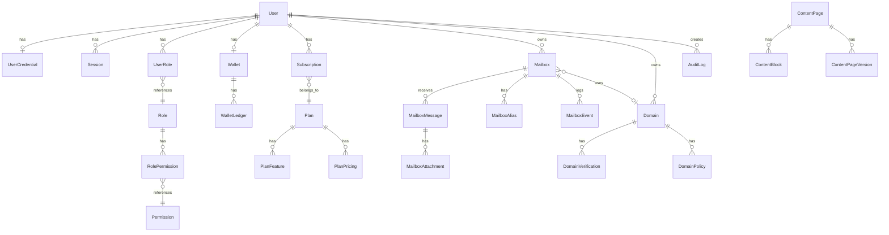

# 🗄️ Database Schema

> PostgreSQL via Prisma ORM — **35+ models**, **846 lines** of schema
> Schema นี้ออกแบบมาเพื่อ Production SaaS ตั้งแต่แรก: Config-driven, Audit-heavy, RBAC-enabled

---

## Entity Relationship Diagram (Simplified)

---

## Model Groups

### 1. Users & Authentication (4 models)

| Model | Purpose | Key Fields |
|-------|---------|------------|
| `User` | ผู้ใช้หลัก | email, displayName, status, publicId |
| `UserCredential` | รหัสผ่าน + MFA | passwordHash, totpSecret, totpEnabled, failedAttempts, lockedUntil |
| `Session` | Session tokens | tokenHash, refreshTokenHash, expiresAt, isAdmin, ipAddress |
| `UserRole` | Mapping user → role | userId, roleId, grantedBy, expiresAt |

### 2. RBAC — Role-Based Access Control (3 models)

| Model | Purpose | Key Fields |
|-------|---------|------------|
| `Role` | บทบาท (SUPER_ADMIN, ADMIN, USER, etc.) | name, displayName, isSystem |
| `Permission` | สิทธิ์ละเอียด (e.g., `admin.user.manage`) | key, module, displayName |
| `RolePermission` | Mapping role → permission | roleId, permissionId |

### 3. Plans & Subscriptions (4 models)

| Model | Purpose | Key Fields |
|-------|---------|------------|
| `Plan` | แพ็คเกจ (Free, Pro, Business) | slug, name, status, isDefault, trialDays |
| `PlanFeature` | ฟีเจอร์ของแต่ละแพ็คเกจ | featureKey, value, valueType |
| `PlanPricing` | ราคา | currency, amount, billingPeriod |
| `Subscription` | การสมัครสมาชิก | status, currentPeriodStart/End, trialEndsAt |

### 4. Billing & Wallet (5 models)

| Model | Purpose | Key Fields |
|-------|---------|------------|
| `Wallet` | กระเป๋าเงินผู้ใช้ | balance, currency, version (optimistic locking) |
| `WalletLedger` | บันทึกรายการเงิน | type (CREDIT/DEBIT/REFUND), amount, balanceBefore/After, idempotencyKey |
| `Topup` | เติมเงิน | amount, status, paymentMethod, externalId |
| `Invoice` | ใบแจ้งหนี้ | amount, status, lineItems, issuedAt, dueAt, paidAt |
| `PaymentTransaction` | รายการชำระเงิน | provider, amount, status, externalId, idempotencyKey |

### 5. Mailboxes (5 models)

| Model | Purpose | Key Fields |
|-------|---------|------------|
| `Mailbox` | กล่องเมลชั่วคราว | address, status, expiresAt, riskScore, messageCount |
| `MailboxAlias` | Alias ของกล่องเมล | alias |
| `MailboxMessage` | อีเมลที่ได้รับ | fromAddress, subject, bodyText, bodyHtml, headers, isRead |
| `MailboxAttachment` | ไฟล์แนบ | filename, contentType, size, storageKey, scanStatus |
| `MailboxEvent` | Event log ของ mailbox | type (created/expired/deleted/message_received) |

### 6. Domains (3 models)

| Model | Purpose | Key Fields |
|-------|---------|------------|
| `Domain` | โดเมนของ mailbox | name, status, isSystem, catchAll |
| `DomainVerification` | ยืนยัน ownership | recordType (TXT/CNAME/MX), recordValue, verified |
| `DomainPolicy` | นโยบายต่อโดเมน | policyKey, policyValue |

### 7. Config & Feature Flags (2 models)

| Model | Purpose | Key Fields |
|-------|---------|------------|
| `ConfigEntry` | ค่า config ที่แก้ไขได้ | key, value (JSON), category, isSecret |
| `FeatureFlag` | Feature toggle | key, enabled, rolloutPct, targetRoles/Plans/Users |

### 8. Security & Audit (4 models)

| Model | Purpose | Key Fields |
|-------|---------|------------|
| `RiskEvent` | เหตุการณ์ความเสี่ยง | type, severity, ipAddress, resolvedAt |
| `AuditLog` | Audit trail | action, actorId, targetType/Id, before/after (JSON snapshot), reason |
| `AdminAction` | Admin actions ที่ต้อง approve | action, reason, requiresApproval, approvedBy |
| `SupportNote` | โน้ตภายในของ support | content, type (note/escalation/resolution) |

### 9. CMS, SEO & Discovery (8 models)

| Model | Purpose | Key Fields |
|-------|---------|------------|
| `ContentPage` | หน้าเว็บที่จัดการผ่าน CMS | slug, locale, type, status, title, metaDescription, canonicalUrl, schemaType |
| `ContentPageVersion` | Version history ของหน้า | versionNumber, title, content (JSON snapshot) |
| `ContentBlock` | Blocks ในหน้า (hero, faq, feature) | type, order, content (JSON) |
| `AnswerBlock` | คำตอบสำหรับ AI/Search Engine | question, answerText, answerHtml, intent, status |
| `FaqItem` | FAQ | question, answer, category, order, isActive |
| `GlossaryTerm` | คำศัพท์ | term, slug, definition, description |
| `KeywordCluster` | กลุ่มคีย์เวิร์ด SEO | name, keywords (JSON), intentId |
| `IntentCluster` | Intent mapping | name, description |

### 10. SEO Infrastructure (3 models)

| Model | Purpose | Key Fields |
|-------|---------|------------|
| `InternalLinkModule` | ลิงค์ภายใน | name, links (JSON), isActive |
| `Redirect` | Redirect rules (301/302) | sourcePath, destinationPath, isPermanent |
| `StructuredDataEntry` | JSON-LD structured data | schemaType, payload (JSON), pageSlug, isGlobal |

---

## Enums Summary

| Enum | Values |
|------|--------|
| `UserStatus` | ACTIVE, SUSPENDED, BANNED, PENDING_VERIFICATION, DEACTIVATED |
| `PlanStatus` | ACTIVE, INACTIVE, GRANDFATHERED, SCHEDULED |
| `SubscriptionStatus` | ACTIVE, TRIALING, PAST_DUE, CANCELED, EXPIRED, PAUSED |
| `LedgerType` | CREDIT, DEBIT, REFUND, ADJUSTMENT, GRANT |
| `TopupStatus` | PENDING, PROCESSING, COMPLETED, FAILED, REFUNDED |
| `InvoiceStatus` | DRAFT, ISSUED, PAID, OVERDUE, CANCELED, REFUNDED |
| `PaymentStatus` | PENDING, PROCESSING, SUCCEEDED, FAILED, REFUNDED, DISPUTED |
| `MailboxStatus` | ACTIVE, EXPIRED, QUARANTINED, DELETED, SUSPENDED |
| `DomainStatus` | PENDING, VERIFIED, ACTIVE, SUSPENDED, ARCHIVED |
